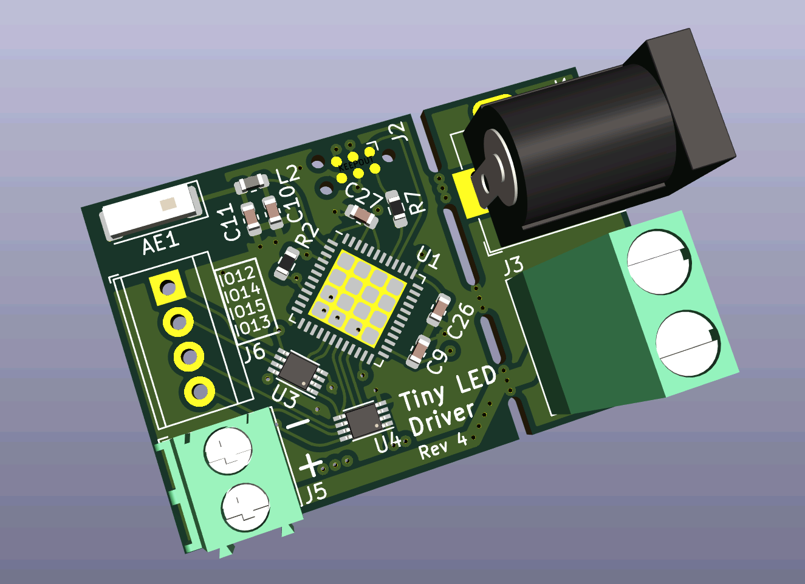
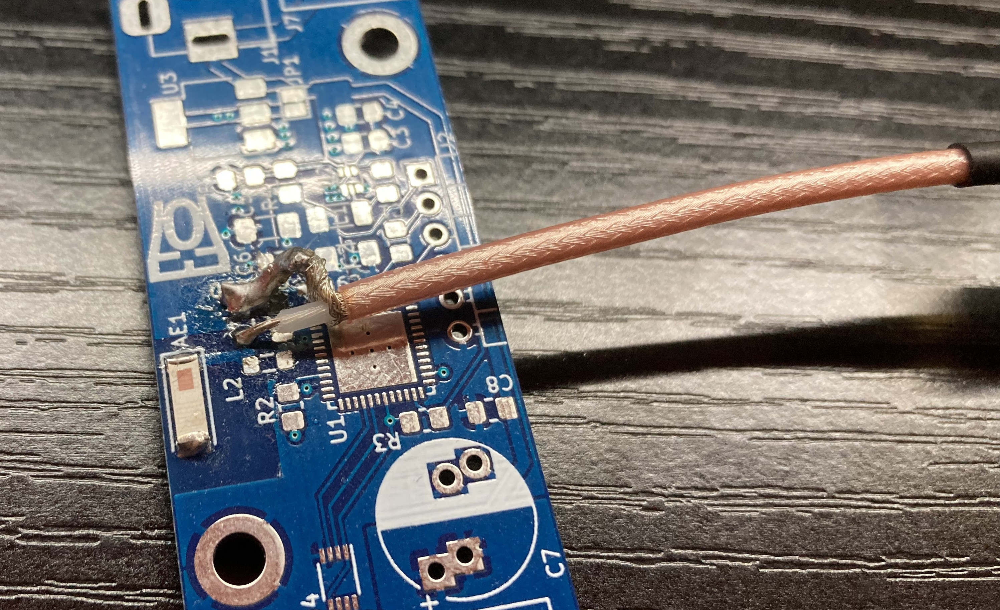
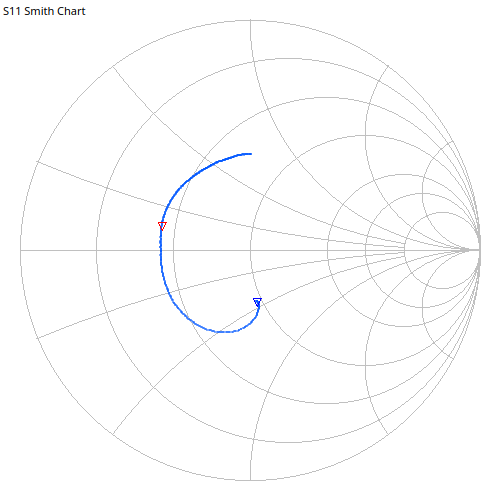
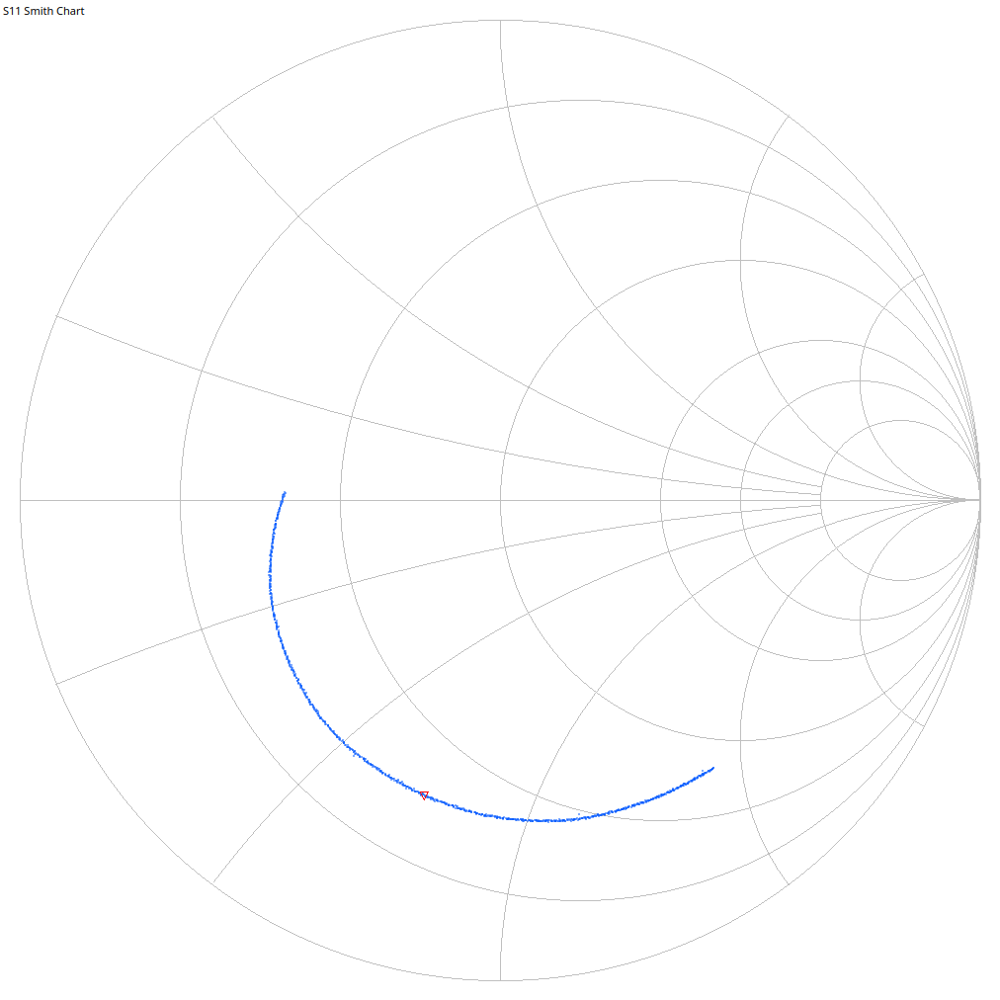

# Addressable LED Strip Controller
#### Rev 4

This is the repository for my LED strip controller. This LED controller is capable of controlling any addressable LED strip (1 or two data wires).

`Image of real PCB Rev4 coming soon!`

## Firmware

This controller uses the [WLED firmware](https://github.com/Aircoookie/WLED). Instructions to upload the firmware unto the board can be found on their webpage.

Thru J2, you can connect an ESP32 programmer such as the ESP-Prog. You can also make your own "automatic downloader" (i.e not requiring to reset the device and selecting boot mode when uploading) circuit. Details of which can be found on Espressif's ESP-Prog docs on [Automatic Downloading Function](https://espressif-docs.readthedocs-hosted.com/projects/espressif-esp-iot-solution/en/latest/hw-reference/ESP-Prog_guide.html#automatic-downloading-function).

## PI Matching Network Values

#### Rev 2

The PI Matching network values have been calculated by measuring the impedance of the antenna mounted on a bare board. As image of the setup is shown below:

The impedance was measured with my handy NanoVNA V2+4. The measured impedance at 2.45Ghz, shown below, was 21.9+5.48jΩ. Plugging those numbers into a [PI matching network calculator](https://www.eeweb.com/tools/pi-match/), we get 2.09nH for L, 2.65pF for Cs, and 3.99pF for Cl. The values have been rounded to the nearest available values that is reasonable to buy (this is RF anyways, I could have sneezed and the values would be slightly off).

#### Rev 4

At 2.45Gz, impedance was 17.5-35.8jΩ. We get 2.3194nH for L, 3.898pF for Cs, and 4.429pF for Cl.

## Rev 3 Branch-Off

Rev 3 of this project was a fully-featured POE version of this controller. I since has made this revision, which is closer to the original small design, so I decided to branch Rev3 off to it's own repo: [Electro707/addressable_led_controller_poe](https://github.com/Electro707/addressable_led_controller_poe)
