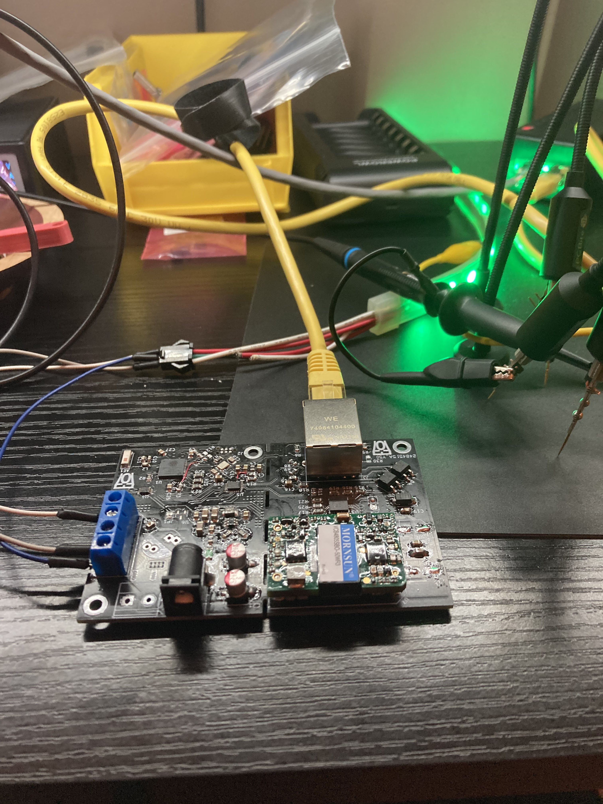

# Addressable LED Strip Controller
#### Rev 3

This is the repository for my LED strip controller. This LED controller is capable of controlling any addressable LED strip (1 or two data wires).

## Hardware Bugs

The following hardware bug exists with this version of the PCB, which will be addessed in the next revision:
- The LED data pin, IO35, is input only. Use IO32/CLK for now.
- The traces to IO16, IO17 are connected to something. Must have trace cut out.
- `E_INT` must be connected to GP0, and disconnected from IO18
- `E_RST` should be pulled down, not up
- `LED2` should have a dedicated pulldown resistor.
- The PHY chip will oscillate even if RESET is held low. Thus to turn on the strip, one must reset the ESP32 randomly until it boots

## Firmware

This controller uses the [WLED firmware](https://github.com/Aircoookie/WLED). Instructions to upload the firmware unto the board can be found on their webpage.

For Rev 3, there is a modified version of WLED to enable Ethernet. The diff is in [docs/rev3_patch.diff](docs/rev3_patch.diff), which is applied to commit `1dab26bcbcac051f2b7be47a2d5c757a9938bf1f`

Thru J2, you can connect an ESP32 programmer such as the ESP-Prog. You can also make your own "automatic downloader" (i.e not requiring to reset the device and selecting boot mode when uploading) circuit. Details of which can be found on Espressif's ESP-Prog docs on [Automatic Downloading Function](https://espressif-docs.readthedocs-hosted.com/projects/espressif-esp-iot-solution/en/latest/hw-reference/ESP-Prog_guide.html#automatic-downloading-function).

## PI Matching Network Values

NOTE: This is based on Rev2's PCB:

The PI Matching network values have been calculated by measuring the impedance of the antenna mounted on a bare board. As image of the setup is shown below:

The impedance was measured with my handy NanoVNA V2+4. The measured impedance at 2.45Ghz, shown below, was 21.9+5.48jΩ. Plugging those numbers into a [PI matching network calculator](https://www.eeweb.com/tools/pi-match/), we get 2.09nH for L, 2.65pF for Cs, and 3.99pF for Cl. The values have been rounded to the nearest available values that is reasonable to buy (this is RF anyways, I could have sneezed and the values would be slightly off).

